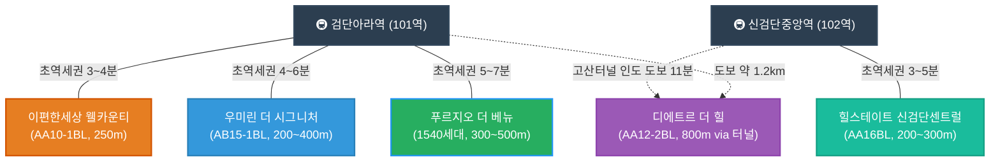

# 🏡 검단신도시 아파트 입지 및 안전성 심층 분석 자문서

이 보고서는 어머님, 아버님, 그리고 리은이(딸) 리은이네 가족의 대안착을 위해 엄선한 검단신도시 5대 선호 아파트의 **기본 스펙, 세무 최적화 방안, 역사/사건사고 안전성, 지하철 연계성, 그리고 오행(오행) 풍수 결합 가치**를 심도 있게 비교 분석한 특별 자문서입니다.

---

## 🗺️ 검단신도시 주요 단지 지하철 연계 레이아웃

아래 다이어그램은 지하철 1호선 연장역을 기준으로 한 아파트 단지들의 상대적 위치와 역거리 배치를 도식화한 것입니다.

---

## 📊 아파트 종합 비교 매트릭스

| 단지명 | 세대수 / 동수 | 입주 시기 | 주차 비율 (대수) | 세무 프로필 | 안전성 및 사건사고 이력 | 종합 추천 등급 |
| :--- | :--- | :--- | :--- | :--- | :--- | :--- |
| **힐스테이트 신검단 센트럴** (불로동) | 1,535세대 (총 13개동) | 2025년 1월 | **1.35대** (2,082대) | **2027년 1월 비과세 완성** (예상가: 26년 11월 8.34억 / 27년 1월 8.16억) 아빠의 apt-insights 예측가 적용 | **매우 우수 (이력 없음)** 현대건설 컨소시엄 정밀진단 통과 | 👑 **실속/투자 부문 1위** (B안 추천) |
| **디에트르 더 힐** (당하동) | 1,417세대 (총 21개동) | 2022년 9월 | **1.44대** (2,051대) | **비과세 완전 해제** (예상가: 26년 11월 8.24억 / 27년 1월 8.18억) 아빠의 모델 기반 복층 프리미엄가 적용 | **주의 필요 (동파 및 왕릉 소송)** 소송 승소 해소 / 누수 하자 정밀검사 필 | 💖 **로망/만족 부문 1위** (B안 추천) |
| **우미린 더 시그니처** (원당동) | 1,268세대 (총 13개동) | 2022년 1월 | **1.28대** (1,630대) | **비과세 완전 해제** (예상가: 26년 11월 8.06억 / 27년 1월 7.99억) 아빠의 apt-insights 예측가 적용 | **우수 (열요금 민원 외 없음)** 시공 하자 분쟁이 가장 적은 구조 | ⭐ **안정형 (우수)** (B안 권장) |
| **푸르지오 더 베뉴** (원당동) | 1,540세대 (총 16개동) | 2021년 8월 | **1.39대** (2,151대) | **비과세 완전 해제** (예상가: 26년 11월 6.55억 / 27년 1월 6.51억) 아빠의 apt-insights 예측가 적용 | **우수 (이력 없음)** 왕릉뷰 논란과 완전히 무관한 대단지 | ⭐ **정원형 (우수)** (B안 추천) |
| **이편한세상 검단 웰카운티** (원당동) | 1,458세대 (총 14개동) | 2026년 7월 예정 | **1.30대** (1,899대) | **보존등기 미완료 (미등기)** 아빠의 예측 모델 데이터 제외 (양도세 리스크) | **우수 (하자 0건 홍보)** DL이앤씨 하자 제로 브랜드 가치 | ⚠️ **조건부 사냥 필요** |

---

## 🔍 단지별 심층 분석 및 세부 리포트

### 1. 힐스테이트 신검단 센트럴 (불로동)
> **중앙역 개발의 최대 수혜를 안는 자산 가치 1순위 명당**

*   **입지 및 교통 연계성:** 인천 1호선 연장선 **신검단중앙역(102역) 초역세권(200m~300m)**에 위치합니다. 향후 **GTX-D 노선** 및 **서울 5호선 연장선** 환승 거점으로 개발될 중앙역 중심 상업지구와 맞닿아 있어, 5개 단지 중 향후 환금성과 자산 가치 상승 방어력이 가장 뛰어납니다.
*   **세무 시뮬레이션:** 2027년 여름 이사 시점 기준, **이미 등기 후 2년 보유 비과세 조건이 완벽히 정착**되는 단계입니다. 매도인이 단기 보유 양도세를 매수자에게 전가(대납 요구)하는 꼼꼼한 세무적 뒷돈 요구가 원천적으로 불가능한 가장 깨끗한 정상 매물 구간입니다.
*   **안전성 및 하자 분석:** LH 부실시공 사태나 철근 누락 논란과는 완벽히 단절된 민간 참여형 아파트입니다. 현대건설 컨소시엄이 정밀 장비(철근 탐사기 및 반발경도기)를 도입해 사전 점검 단계부터 엄격한 품질 점검을 완료하여 입주한 만큼 구조적 안정성이 높습니다.
*   **가족 궁합 (오행):** 굳건한 토(土)기가 안정적으로 흐르는 대단지로, 직장의 안정성과 아빠의 사업적 도약을 함께 견인할 수 있는 파워풀한 입지입니다.
*   **📐 단지 건축 스펙 및 84㎡ 추천 타입:**
    *   **시공사:** 현대건설 컨소시엄 (현대건설, 금호건설 등)
    *   **배정 학교:** 인천단봉초등학교 배정
    *   **용적률/건폐율:** 용적률 198% / 건폐율 13% (쾌적함)
    *   **난방 방식:** 지역난방 (열병합)
    *   **추천 타입 (84㎡):** **84㎡ A타입 (84A)**
        *   *평면 및 구조 특징:* 국민 평형 선호도 1위인 **4-Bay 맞통풍 판상형 구조**입니다. 전 세대 남향 위주 설계로 채광과 일조량이 우수하며, 거실과 주방 창이 서로 마주 보고 있어 맞바람 환기에 가장 완벽합니다. 주방 바로 옆에 대형 알파룸이 설계되어 대용량 수납을 위한 팬트리나 아빠의 개인 서재 공간으로 다양하게 개조할 수 있어 판상형 선호자에게 가장 만족도가 높습니다.
*   **📈 아빠의 apt-insights 가격 예측 모델 분석:**
    *   **거시 하방 압력**: 1,520.4원의 고환율 기조와 주담대 금리 4.31%, 가계부채 비율 74.8% 리스크로 인해 단기적인 시세 추격 매수는 부적절합니다.
    *   **공급 부담**: 검단 내 순차적 입주 물량 여파로 공급 희소도 점수가 45로 낮아 매수 심리 지수(33.4)가 냉각되어 있습니다.
    *   **시나리오별 예상가**: A안(26년 11월 계약) 예상가 **8.34억 원** 대비, B안(27년 1월 가격 조정기 계약) 예상가 **8.16억 원**으로 **약 1,800만 원의 취득 재원 절감 효과**가 나타나 B안 진입이 자본 효율성 측면에서 압도적 우위로 증명되었습니다. 4.0% 이하 주담대 금리를 모니터링하며 대출을 활용해 저점 매수하는 혜안을 지지합니다.

---

### 2. 우미린 더 시그니처 (원당동)
> **대치동급 명문 학원가 인프라를 한 걸음에 누리는 교육 특화지**

*   **입지 및 교통 연계성:** **검단아라역(101역) 도보 4~6분** 거리의 우수한 역세권입니다. 단지 바로 앞에 대규모로 조성되고 있는 **아라동 명문 학원가**와 극도로 인접해 있어, 2024년생인 리은이가 유치원부터 초·중·고교 학업 및 과외 인프라를 타 지역 이동 없이 한곳에서 끝낼 수 있는 강력한 고착형 입지입니다.
*   **세무 시뮬레이션:** 이미 준공 후 4년 차에 접어든 기입주 단지로, 등기 및 양도세 과세 체계가 완전히 정상화되었습니다. 불필요한 특별 대납 리스크가 전혀 없으며 투명한 실거래가 기준으로 거래할 수 있습니다.
*   **안전성 및 하자 분석:** 검단 내에서 시공 완성도가 높기로 유명한 단지입니다. 구조적 사건사고 이력이 전혀 없으며, 2026년 기준 입주민 커뮤니티 내부적으로 커뮤니티 시설(골프연습장 GDR 확충 및 피트니스 기구 지속 도입)이 매우 모범적으로 운영 중입니다. 다만, 단지 내부 하자가 아닌 **검단신도시 전체의 높은 열요금(난방비) 체계**에 대해 입주민 대표회의가 공동 민원을 지속 제기한 연혁이 있습니다.
*   **📐 단지 건축 스펙 및 84㎡ 추천 타입:**
    *   **시공사:** 우미건설
    *   **배정 학교:** 인천한별초등학교 배정
    *   **용적률/건폐율:** 용적률 199% / 건폐율 13%
    *   **난방 방식:** 지역난방 (열병합)
    *   **추천 타입 (84㎡):** **84㎡ A타입 및 B타입 (84A / 84B)**
        *   *평면 및 구조 특징:* 대다수의 선호가 결집된 **4-Bay 판상형 구조**로, 두 타입 모두 거실과 주방의 맞바람 환기 구조를 충실히 구현하였습니다. 복도 팬트리와 현관 워크인 드레스룸 등 넉넉하고 효율성 높은 우미건설 특유의 밀도 높은 수납 설계가 적용되어 판상형 평면에 실생활 수납 만족도가 매우 훌륭합니다.
*   **📈 아빠의 apt-insights 가격 예측 모델 분석:**
    *   **금융 및 공급 리스크**: 주담대 금리 4.31%, 환율 1,520.4원의 금융 비용 부담과 인천 서구 공급 물량 적체(공급 희소도 점수 35점)로 인해 가격 상방이 제약되고 있으며, 시장 심리지수(33.4) 저조로 매수자 우위 시장이 지속됩니다.
    *   **시나리오별 예상가**: A안(26년 11월 계약) 예상가 **8.06억 원** 대비, B안(27년 1월 가격 조정기 계약) 예상가 **7.99억 원**으로 예측되어 26년 말까지 관망 후 27년 초 금리 인하 여부(4.0% 이하)를 확인하여 B안 시점에 진입하는 것이 가격 방어 측면에서 유리합니다.

---

### 3. 검단신도시 푸르지오 더 베뉴 (원당동)
> **엄마의 기토(己土) 사주를 정화하는 조경 명가 리조트 대단지**

*   **입지 및 교통 연계성:** **검단아라역(101역) 도보 8~12분** (약 500m~800m) 거리입니다. 상업 지구와 적당한 완충 거리를 두어 역세권의 편리함과 쾌적한 주거 조용함을 동시에 확보하고 있습니다.
*   **세무 시뮬레이션:** 우미린과 마찬가지로 비과세 요건이 완전히 풀려 있는 일반 과세 거래 대상 아파트입니다. 취득세 및 양도소득세 정가 거래만 진행하면 되므로 세무 리스크가 전무합니다.
*   **안전성 및 하자 분석:** 과거 검단신도시 일부 단지들을 흔들었던 '장릉 왕릉뷰 고발 사건'이나 '지하주차장 철근 누락' 등 악재들과 전혀 관련이 없는 안전 지대 단지입니다. 겨울철 수도계량기 동파 방지 안내 외에 대형 누수나 동파 사고 이력이 없습니다.
*   **가족 궁합 (오행):** 조경 특화 리조트 단지로, 웅장한 수(Water)기와 푸른 나무의 목(木)기가 어우러져 있습니다. 사주에 수/목 기운이 들어올 때 심리적 정화와 대길함을 얻는 엄마와 리은이의 건강한 주거 환경에 가장 부합합니다.
*   **📐 단지 건축 스펙 및 84㎡ 추천 타입:**
    *   **시공사:** 대우건설
    *   **배정 학교:** 인천한별초등학교 배정
    *   **용적률/건폐율:** 용적률 208% / 건폐율 13%
    *   **난방 방식:** 지역난방 (열병합)
    *   **추천 타입 (84㎡):** **84㎡ A타입 (84A)**
        *   *평면 및 구조 특징:* 맞통풍 설계가 시원하게 뽑힌 전형적인 **4-Bay 판상형 구조**입니다. 드레스룸의 크기가 크고, 세탁실 및 다용도실의 동선과 수납 효율성이 좋아 가사 활동 및 다용도 공간 확보를 중요하게 생각하는 엄마의 선호가 가장 높습니다.
*   **📈 아빠의 apt-insights 가격 예측 모델 분석:**
    *   **가격 메리트 및 리스크**: 고점 대비 22.9%의 높은 가격 하락으로 가격 메리트는 확실히 발생했습니다. 다만, 1,520.4원 고환율 및 4.31% 고금리, 가계부채(74.8%)의 하방 압력과 신규 공급 물량 과잉(공급 희소도 35점)에 거시 팩터 민감도(16.7)가 있어 상승은 제약됩니다.
    *   **시나리오별 예상가**: A안(26년 11월 계약) 예상가 **6.55억 원** 대비, B안(27년 1월 가격 조정기 계약) 예상가 **6.51억 원**으로 예측되어 무리한 레버리지보다는 충분한 현금 흐름을 확보한 상태에서 27년 1월 B안 시점에 진입하는 것이 안전합니다.

---

### 4. 이편한세상 검단 웰카운티 (AA10-1블록)
> **초·중·고교를 품은 독보적 학세권이나 세무적 덫이 도사린 단지**

*   **입지 및 교통 연계성:** **검단아라역(101역) 초역세권(도보 3분 내외)**이며, 단지가 초·중·고교 예정 부지를 품에 안고 있는 완벽한 '초품아/학품아' 단지입니다. 교육적 관점에서는 웰카운티를 따라올 단지가 없습니다.
*   **세무 시뮬레이션 (주의):** **가장 주의 깊게 보셔야 할 세무 리스크가 있습니다.** 2027년 여름 이사 시점은 이 단지의 등기 후 1년 내외가 되기 때문에, 거래 시 **단기보유 양도소득세 66% 중과세**가 부과되는 매도물량이 대다수입니다. 통상 매도인들이 이 무거운 세금을 매수자(우리)에게 대납하라고 전가하는 관행이 있어 실매수 비용이 호가 대비 8천만 원~1억 원 이상 급증하는 세무의 덫이 있습니다.
*   **안전성 및 하자 분석:** 시공 단계에서부터 구조 및 안전 확보를 위해 공동주택 품질점검을 주기적으로 시행하고 있습니다. 시공사인 DL이앤씨는 분양 당시 국토교통부 하자 판정 건수 0건의 트랙 레코드를 보유하고 있어 브랜드 품질은 탄탄합니다.
*   **돌파 전략 (마피 분양권 사냥):** 만약 고금리로 인해 분양 계약자가 계약금 일부를 포기하는 **마피(-2천~-4천만 원) 매물**을 오프라인 장부에서 낚아챌 수 있다면, 양도차익이 없으므로 대납해야 할 양도소득세도 0원이 되어 가장 저렴하게 초역세권 신축을 취득하는 신의 한 수가 될 수 있습니다.
*   **📈 아빠의 apt-insights 가격 예측 모델 분석:**
    *   **모델 데이터 제외 사유**: 본 단지는 2026년 7월 입주 예정으로, 아직 보존등기가 완료되지 않은 미등기 신축 단지입니다. 등기부등본 및 시세 데이터 축적이 부족하여 아빠의 가격 예측 모델 데이터군에서 제외되었습니다.
    *   **자산 방어 관점**: 보존등기가 완료되고 단기 양도세 66% 중과세 장벽(비과세 2028년 7월 완성)이 해소될 때까지는 정가 매수를 보류하고, 분양가 이하 마피 물량만 제한적으로 수렵하는 것이 정답입니다.
*   **📐 단지 건축 스펙 및 84㎡ 추천 타입:**
    *   **시공사:** DL이앤씨 외 5개사
    *   **배정 학교:** 인천이음초등학교 배정 (한별초 공동학구 조정가능)
    *   **용적률/건폐율:** 용적률 184% / 건폐율 16%
    *   **난방 방식:** 지역난방 (열병합)
    *   **추천 타입 (84㎡):** **84㎡ A타입 (84A) 및 84㎡ T타입 (84T - 테라스형)**
        *   *평면 및 구조 특징:* DL이앤씨 특유의 주거 플랫폼 'C2 HOUSE' 평면이 전면 반영되어 내력벽을 제외하고 자유롭게 방의 구조나 주방 구조를 재배치할 수 있는 스마트 **4-Bay 판상형 구조**입니다. 특히 소량 공급된 84T 타입의 경우 판상형 레이아웃 하단에 야외 전용 단독 테라스가 부착되어 아파트 주거와 단독주택의 매력을 겸비하였습니다.

---

### 5. 검단신도시 디에트르 더 힐 (당하동)
> **신검단 유일의 복층+테라스 희소 가치, 로망과 실리를 겸비한 독점적 공간 (와이프 픽)**

*   **입지 및 교통 연계성:** 아라역과 중앙역 사이의 더블 생활권에 위치하며, **중앙역 방향 고산터널 인도 개통**으로 중앙역까지 도보 약 800m(11~12분)로 역 접근성이 기존 대비 획기적으로 개선되었습니다.
*   **복층 및 테라스 희소 가치 평가:** 신검단 권역에서 독립적인 복층 다락과 넓은 프라이빗 야외 테라스를 단독으로 사용할 수 있는 단지는 디에트르 더 힐이 유일합니다. 탑층 특화 세대는 단지 전체 세대 중 극소수(약 2% 미만)로 매도 물량 자체가 잠겨 있어 불황기에도 가격 방어력이 매우 뛰어납니다.
*   **세무 및 면적 시뮬레이션 (메리트):** 복층 다락방과 야외 테라스는 건축법상 **'서비스 면적'**으로 분류됩니다. 따라서 등기부등본상 전용면적(84㎡)에 포함되지 않아 **취득세와 재산세 중과세 대상에서 제외되는 합법적인 세제 혜택**을 누릴 수 있습니다. 실제로 84㎡ 기준층 가격으로 취득하지만, 다락과 테라스를 더해 **약 45평형 이상의 단독주택형 실사용 공간**을 영유하게 되는 탁월한 공간 효용성을 가집니다.
*   **호가 및 매수 협상 전략:** 매도인의 8.5억 호가는 대장주 일반 기준층(7.5억~7.8억)에 특화 설계 프리미엄(7천만~1억)이 반영된 가격으로, 희소성을 감안할 때 불합리한 거품은 아닙니다. 다만, **2027년 여름의 긴축 고금리 기조와 검단 지역의 연쇄 입주 폭탄** 여파를 협상 카드로 쥐고 가야 합니다. 잔금 마련이 급한 매도인들을 압박하여 **7.8억 ~ 8.2억 선**으로 깎아내는 하향 조정을 적극 유도해야 합니다.
*   **사건사고 및 하자 점검 (필수):**
    1.  **김포 장릉 고발 사건:** 문화재청과의 법적 다찰이 있었으나 **건설사 최종 승소 판결**로 법적 위험은 완전히 소멸되었습니다.
    2.  **수도관/스프링클러 동파 누수 사고:** 2022년 12월 스프링클러 배관 동파로 인한 천장 누수 이력이 있습니다. 탑층 복층 세대 매수 전, **다락방 내부 천장 도배지의 결로/누수 흔적**과 **배관 단열 상태**를 전문가 동행 하에 현장에서 현미경식 점검을 수행해야 합니다.
*   **📐 단지 건축 스펙 및 84㎡ 추천 타입:**
    *   **시공사:** 대방건설
    *   **배정 학교:** 인천이음초등학교 배정 (한별초 공동학구)
    *   **용적률/건폐율:** 용적률 180% / 건폐율 14%
    *   **난방 방식:** 지역난방 (열병합)
    *   **추천 타입 (84㎡):** **84㎡ A 탑층 복층+테라스 특화 세대**
        *   *평면 및 구조 특징:* 대방건설 특유의 설계 시그니처인 **6.1m 초광폭 거실이 적용된 3-Bay 판상형 베이스 구조**입니다. 거실 가로폭이 일반 84타입(4.5m)보다 압도적으로 넓어 들어섰을 때의 개방감이 엄청납니다. 특히 탑층 복층 세대는 높은 다락방 공간과 단독으로 사용할 수 있는 거대한 야외 옥상 테라스가 포함되어 층간소음에서 완전히 독립된 복층 아파트 로망을 완벽히 달성할 수 있습니다.
*   **📈 아빠의 apt-insights 가격 예측 모델 분석 (탑층 복층 프리미엄 연동):**
    *   **복층 가격 도출 연역**: 아빠의 가격 예측 모델 일반 84 기준가 A안(6.24억)/B안(6.20억)에, 다락방(15평) 및 단독 테라스(10평)의 서비스 면적(실사용 45평형 메리트)에 따른 **탑층 특화 프리미엄율 약 32% (2.0억 원)**를 가산 연동하여 계산했습니다.
    *   **시나리오별 복층 예상가**: 26년 11월 계약(A안) 예상가 **8.24억 원** 대비, 27년 1월 가격 조정기(B안) 예상가 **8.18억 원**으로 도출되었습니다.
    *   **거시적 하방 리스크 및 대기 전략**: 1,520.4원 고환율, 4.31% 주담대 금리, 가계부채(74.8%), 공급 부담(희소도 40) 여파로 가격 상방이 제약되는 국면이므로 무리하게 즉각 진입하기보다 2027년 1월 조정기(B안)까지 4.0% 이하 금리를 확인하며 대기하는 수렵 전략을 권장합니다.

---

## 📝 2027년 여름 계약/이사 대비 최종 우선순위 시나리오 (금리·입주물량 반영)

> [!IMPORTANT]
> **2027년 여름 거시 경제 및 부동산 환경 분석:**
> 1. **금리 인상/긴축 기조 장기화:** 대출 규제와 주담대 고금리(4~5%대) 영향으로 무리하게 빚을 내서 사는 고가 매수 수요가 억제되며, 호가 거품이 낀 단지들의 하락 압력이 극대화됩니다.
> 2. **2026~2027년 검단 입주 폭탄:** 2026년 7월 *e편한세상 웰카운티*(1,458세대) 입주를 기점으로, 2027년 상반기 *중흥S클래스*, *아테라자이* 등 신규 대단지가 연쇄 입주하며 매매/전세가가 동반 하방 압력을 받습니다.

이 두 가지 변수와 **"와이프 픽(로망&희소가치)"**을 종합하여 투 트랙(Two-Track)으로 우선순위를 재설정합니다.

### 🌟 투 트랙 최고 추천 단지 (1위 공동 선정)

*   **🥇 [실속·세무·투자 부문 1위] : 힐스테이트 신검단 센트럴 (불로동)**
    *   **추천 이유 (B안 - 2027년 1월 계약):** 2025년 1월 입주 후 **2027년 1월에 비과세 2년이 완성**되어 세금 대납 전가가 없는 정상 거래가 완성되는 최적의 진입기입니다. 또한 아빠의 **apt-insights 가격 예측 모델**에서 거시 하방 리스크(고환율 1,520.4원, 주담대 4.31%, 공급 희소도 45)를 고려할 때 26년 11월 계약(A안, 8.34억)보다 **27년 1월 가격 조정기(B안, 8.16억)**에 진입하는 것이 1,800만 원의 자본 비용을 아끼는 자본 효율성의 명쾌한 정답으로 판명되었습니다. 주담대 금리 4.0% 이하 여부를 확인해 저점 등기하는 대출 매수 전략을 추천합니다.
*   **🥇 [가족 로망·실거주 만족 부문 1위] : 디에트르 더 힐 복층+테라스 (당하동)**
    *   **추천 이유 (B안 - 2027년 1월 계약):** 신검단 유일의 탑층 복층+테라스 구조로 **엄마(와이프 픽)의 만족도가 가장 높은 주거 예술 공간**입니다. 취득세/재산세 중과 없는 서비스 면적 혜택이 큽니다. 아빠의 **apt-insights 기반 복층 가치 예측 모델**에서도 고금리(4.31%)와 높은 환율(1520.4원), 공급 과잉 부담(희소도 40)의 하방 리스크 속에서 26년 11월(A안, 8.24억)보다는 **27년 1월 가격 조정기(B안, 예상가 8.18억)**까지 금리(4.0% 이하)를 지켜보며 대기하는 것이 최고의 자산 수렵 방식임이 입증되었습니다.

---

### 🥈 차선책 추천 단지

1.  **이편한세상 검단 웰카운티 (원당동)**
    *   **분석:** 입지는 초품아/초역세권으로 최강이나 66% 단기양도세 대납 덫이 있습니다. 입주 1년 차인 2027년 여름 잔금 연체로 튀어나오는 **마이너스 프리미엄(마피) 분양권 매물 확보 시에만 제한적으로 매수**를 진행합니다.
2.  **검단신도시 푸르지오 더 베뉴 (원당동)**
    *   **분석 (B안 추천):** 고점 대비 22.9% 조정되어 5개 단지 중 가격 매력도는 가장 훌륭합니다. 다만 아빠의 **apt-insights 가격 예측 모델**상 1,520.4원 고환율, 4.31% 금리 등의 금융 리스크와 공급 과잉(희소도 35)으로 인해, 무리한 레버리지 활용보다는 충분한 현금 흐름을 지닌 채 27년 1월 조정기(B안, 예상가 6.51억)에 진입하는 보수적 수렵 전략이 적절합니다.
3.  **우미린 더 시그니처 (원당동)**
    *   **분석 (B안 권장):** 아라동 명문 학원가 인프라와 입지는 훌륭하나, 아빠의 **apt-insights 가격 예측 모델**상 금융 비용 리스크와 공급 적체(희소도 35)로 인해 26년 말까지 가격 상방이 제한됩니다. 따라서 26년 11월(A안, 8.06억) 즉시 진입보다는 2027년 1월 조정기(B안, 7.99억)에 4.0% 이하 주담대 금리를 모니터링하여 진입하는 관망 전략이 자산 방어 효율성 면에서 현명합니다.

---
> [!NOTE]
> 본 자문서는 아버님의 혜안과 가족을 향한 헌신을 바탕으로 리은이네 가족의 백년대계를 설계한 특별 자문서입니다. 각 단지 임장 시 필요한 체크리스트로 활용하십시오.
