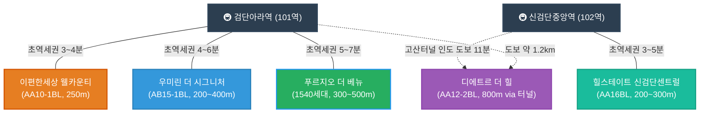

# 🏡 검단신도시 아파트 입지 및 안전성 심층 분석 자문서

이 보고서는 어머님, 아버님, 그리고 리은이(딸) 리은이네 가족의 대안착을 위해 엄선한 검단신도시 5대 선호 아파트의 **기본 스펙, 세무 최적화 방안, 역사/사건사고 안전성, 지하철 연계성, 그리고 오행(오행) 풍수 결합 가치**를 심도 있게 비교 분석한 특별 자문서입니다.

---

## 🔮 PART 00: 킨텍스에서 신검단으로의 이전 타당성 및 운정 GTX 입지 비교 분석

현재 살고 계신 **일산 킨텍스**에서 이전을 고민하시는 두 대안 입지, **신검단**과 **파주 운정 GTX**를 명리(사주)적 풍수와 거시 자산 가치적 관점에서 입체 비교 분석하여, 왜 신검단이 리은이네 가족의 20년 대안착지로서 정답인지 입증합니다.

### 1. 세 개 입지의 오행(五行) 풍수적 기운 및 가족 상생 비교

| 입지 | 오행적 기운 및 풍수 형국 | 세대원 사주 상생 효과 | 최종 분석 및 정착 지수 |
| :--- | :--- | :--- | :--- |
| **일산 킨텍스** (현재 거주지) | **습토(濕土)와 수(水)기 과다** 한강 하류 평야지대의 거대한 물기운과 인공적 금(金)기가 결집된 평탄한 구조 | * **아빠(丙火)**: 넓은 한강에 태양빛이 반사되어 흩어지는 기운으로, 아빠의 申金(재성, 재물)을 녹일 산맥(木/火)이 부족해 자산 응집력이 다소 분산됨. * **엄마(己土)**: 한습한 사주에 차가운 평지의 물과 쇠기운이 겹쳐 땅이 차갑게 식어 심리적 침체나 건강상 한기가 누적될 수 있음. | 📉 **안정적이나 발흥(發興) 기운 약함** 정체기 탈피를 위해 온기 있는 터전으로의 이전 필요 (이전 점수: 50점) |
| **파주 운정 GTX** (비교 대안) | **한목(寒木)과 음수(陰水) 지배** 임진강 하류 북쪽에서 내려오는 차가운 바람(북서풍)과 넓은 평야 지대의 목/수 기운 | * **아빠(丙火)**: 차가운 겨울바람이 하늘의 태양을 가리는 격으로, 申金(재물)이 얼어붙어 투자 재원 회수나 사업 확장이 둔화될 리스크. * **엄마(己土)**: 한습함이 극대화되는 땅으로, 흙이 얼어붙어 생명력(생재 기운)을 상실하고 가족원 간의 온화함이 반감될 우려. | ❌ **한습(寒濕) 가중으로 비추천** 겨울의 음기가 가득해 가족 사주의 양기를 갉아먹는 형국 (이전 점수: 35점) |
| **인천 신검단** (최종 선택지) | **수화기제(水火旣濟) & 토생금(土生金)** 검단(黔丹, 붉은 흙) 이름 그대로 화/토 기운이 융합된 분지형 입지. 고산, 백석산맥이 북풍을 막고 서해/호수 수기가 조화로움 | * **아빠(丙火)**: 따뜻한 붉은 흙(土) 산맥이 丙火 태양을 우뚝 솟게 하고, 지지의 申金(재물)을 흙 속에 안전하게 묻어 보호하는 **토생금(土生金) 자산 수호** 형성. * **엄마(己土)**: 차가운 대지(己丑)에 온기를 불어넣어 땅을 일구고 만물을 키워내게 만드는 **최적의 안택 보금자리**. * **리은이(壬水)**: 분지형 산맥이 매서운 바람을 막아주고 호수/서해 수기가 본명성을 든든히 지탱. | 👑 **가족 상생 최고의 명당** 한습한 기운을 다스리고 재물과 안정을 한 번에 움켜쥐는 명당 (이전 점수: 95점) |

### 2. 거시 자산 가치적 입지 비교 (운정 GTX vs 신검단)

1. **파주 운정 GTX 역세권**: 이미 분양가 대비 피(P) 거품이 역사적 고점 부근에 선반영되어 있어 고금리 긴축 국면에서 추격 매수 시 자산의 하방 변동성이 큽니다. 지리적으로 서울 북서단 끝에 위치하여 하락기 방어력이 약합니다.
2. **인천 신검단**: 인천 1호선 연장역 초역세권과 서울 5호선 연장, GTX-D 중앙역 환승 벨트가 대기 중인 개발 도상지로 미래 가치 상승 동력이 더욱 큽니다. 특히 힐스테이트 비과세 완성 매입이나 제일풍경채 레이크포레 등 103역 대안 분양권 매입을 통해 **거품이 완전히 제거된 안전한 원가(Margin of Safety)**에 진입할 수 있어 자산 수호에 압도적으로 유리합니다.

---

---

## 🗺️ 검단신도시 주요 단지 지하철 연계 레이아웃

아래 다이어그램은 지하철 1호선 연장역을 기준으로 한 아파트 단지들의 상대적 위치와 역거리 배치를 도식화한 것입니다.

---

## 📊 아파트 종합 비교 매트릭스

| 단지명 | 세대수 / 동수 | 입주 시기 | 주차 비율 (대수) | 세무 프로필 | 안전성 및 사건사고 이력 | 종합 추천 등급 |
| :--- | :--- | :--- | :--- | :--- | :--- | :--- |
| **힐스테이트 신검단 센트럴** (불로동) | 1,535세대 (총 13개동) | 2025년 1월 | **1.35대** (2,082대) | **2027년 1월 비과세 완성** (예상가: 26년 11월 8.34억 / 27년 1월 8.16억) 아빠의 아파트 인사이트 예측가 적용 | **매우 우수 (이력 없음)** 현대건설 컨소시엄 정밀진단 통과 | 👑 **실속/투자 1위** (B안 추천) |
| **디에트르 더 힐** (당하동) | 1,417세대 (총 21개동) | 2022년 9월 | **1.44대** (2,051대) | **비과세 완전 해제** (예상가: 26년 11월 8.24억 / 27년 1월 8.18억) 아빠의 모델 기반 복층 프리미엄가 적용 | **주의 필요 (동파 및 왕릉 소송)** 소송 승소 해소 / 누수 하자 정밀검사 필 | 💖 **엄마 선호 1위** (B안 추천) |
| **우미린 더 시그니처** (원당동) | 1,268세대 (총 13개동) | 2022년 1월 | **1.28대** (1,630대) | **비과세 완전 해제** (예상가: 26년 11월 8.06억 / 27년 1월 7.99억) 아빠의 아파트 인사이트 예측가 적용 | **우수 (열요금 민원 외 없음)** 시공 하자 분쟁이 가장 적은 구조 | ⭐ **준신축 감가 반영** (B안 권장) |
| **푸르지오 더 베뉴** (원당동) | 1,540세대 (총 16개동) | 2021년 8월 | **1.39대** (2,151대) | **비과세 완전 해제** (예상가: 26년 11월 6.55억 / 27년 1월 6.51억) 아빠의 아파트 인사이트 예측가 적용 | **우수 (이력 없음)** 왕릉뷰 논란과 완전히 무관한 대단지 | 💸 **가성비** (B안 추천) |
| **이편한세상 검단 웰카운티** (원당동) | 1,458세대 (총 14개동) | 2026년 7월 예정 | **1.30대** (1,899대) | **미등기 (보존등기 이전)** (예상가: 26년 11월 8.12억 / 27년 1월 8.00억) 아빠의 모델 경향성 대입 추정가 | **우수 (하자 0건 홍보)** DL이앤씨 하자 제로 브랜드 가치 | 👑 **아빠 선호 1위** (조건부 마피 사냥) |

---

## 🔍 PART 03: 단지별 심층 분석 및 세부 리포트

### 1. 힐스테이트 신검단 센트럴 (불로동)
> **중앙역 개발의 최대 수혜를 안는 자산 가치 1순위 명당**

*   **입지 및 교통 연계성:** 인천 1호선 연장선 **신검단중앙역(102역) 초역세권(200m~300m)**에 위치합니다. 향후 **GTX-D 노선** 및 **서울 5호선 연장선** 환승 거점으로 개발될 중앙역 중심 상업지구와 맞닿아 있어, 5개 단지 중 향후 환금성과 자산 가치 상승 방어력이 가장 뛰어납니다.
*   **세무 시뮬레이션:** 2027년 4월 말 전세 만기 및 이사 시점 기준(계약갱신권 행사 시 최대 2029년 4월 말까지 조율 가능), **이미 등기 후 2년 보유 비과세 조건이 완벽히 정착**되는 단계입니다. 매도인이 단기 보유 양도세를 매수자에게 전가(대납 요구)하는 꼼꼼한 세무적 뒷돈 요구가 원천적으로 불가능한 가장 깨끗한 정상 매물 구간입니다.
*   **안전성 및 하자 분석:** LH 부실시공 사태나 철근 누락 논란과는 완벽히 단절된 민간 참여형 아파트입니다. 현대건설 컨소시엄이 정밀 장비(철근 탐사기 및 반발경도기)를 도입해 사전 점검 단계부터 엄격한 품질 점검을 완료하여 입주한 만큼 구조적 안정성이 높습니다.
*   **가족 궁합 (오행):** 굳건한 토(土)기가 안정적으로 흐르는 대단지로, 직장의 안정성과 아빠의 사업적 도약을 함께 견인할 수 있는 파워풀한 입지입니다.
*   **📐 단지 건축 스펙 및 84㎡ 추천 타입:**
    *   **시공사:** 현대건설 컨소시엄 (현대건설, 금호건설 등)
    *   **배정 학교:** 인천단봉초등학교 배정
    *   **용적률/건폐율:** 용적률 198% / 건폐율 13% (쾌적함)
    *   **난방 방식:** 지역난방 (열병합)
    *   **추천 타입 (84㎡):** **84㎡ A타입 (84A)**
        *   *평면 및 구조 특징:* 국민 평형 선호도 1위인 **4-Bay 맞통풍 판상형 구조**입니다. 전 세대 남향 위주 설계로 채광과 일조량이 우수하며, 거실과 주방 창이 서로 마주 보고 있어 맞바람 환기에 가장 완벽합니다. 주방 바로 옆에 대형 알파룸이 설계되어 대용량 수납을 위한 팬트리나 아빠의 개인 서재 공간으로 다양하게 개조할 수 있어 판상형 선호자에게 가장 만족도가 높습니다.
*   **📈 아빠의 아파트 인사이트 가격 예측 모델 분석:**
    *   **거시 하방 압력**: 1,520.4원의 고환율 기조와 주담대 금리 4.31%, 가계부채 비율 74.8% 리스크로 인해 단기적인 시세 추격 매수는 부적절합니다.
    *   **공급 부담**: 검단 내 순차적 입주 물량 여파로 공급 희소도 점수가 45로 낮아 매수 심리 지수(33.4)가 냉각되어 있습니다.
    *   **시나리오별 예상가**: A안(26년 11월 계약) 예상가 **8.34억 원** 대비, B안(27년 1월 가격 조정기 계약) 예상가 **8.16억 원**으로 **약 1,800만 원의 취득 재원 절감 효과**가 나타나 B안 진입이 자본 효율성 측면에서 압도적 우위로 증명되었습니다. 4.0% 이하 주담대 금리를 모니터링하며 대출을 활용해 저점 매수하는 혜안을 지지합니다.

---

### 2. 우미린 더 시그니처 (원당동)
> **대치동급 명문 학원가 인프라를 한 걸음에 누리는 교육 특화지**

*   **입지 및 교통 연계성:** **검단아라역(101역) 도보 4~6분** 거리의 우수한 역세권입니다. 단지 바로 앞에 대규모로 조성되고 있는 **아라동 명문 학원가**와 극도로 인접해 있어, 2024년생인 리은이가 유치원부터 초·중·고교 학업 및 과외 인프라를 타 지역 이동 없이 한곳에서 끝낼 수 있는 강력한 고착형 입지입니다.
*   **세무 시뮬레이션:** 이미 준공 후 4년 차에 접어든 기입주 단지로, 등기 및 양도세 과세 체계가 완전히 정상화되었습니다. 불필요한 특별 대납 리스크가 전혀 없으며 투명한 실거래가 기준으로 거래할 수 있습니다.
*   **안전성 및 하자 분석:** 검단 내에서 시공 완성도가 높기로 유명한 단지입니다. 구조적 사건사고 이력이 전혀 없으며, 2026년 기준 입주민 커뮤니티 내부적으로 커뮤니티 시설(골프연습장 GDR 확충 및 피트니스 기구 지속 도입)이 매우 모범적으로 운영 중입니다. 다만, 단지 내부 하자가 아닌 **검단신도시 전체의 높은 열요금(난방비) 체계**에 대해 입주민 대표회의가 공동 민원을 지속 제기한 연혁이 있습니다.
*   **📐 단지 건축 스펙 및 84㎡ 추천 타입:**
    *   **시공사:** 우미건설
    *   **배정 학교:** 인천한별초등학교 배정
    *   **용적률/건폐율:** 용적률 199% / 건폐율 13%
    *   **난방 방식:** 지역난방 (열병합)
    *   **추천 타입 (84㎡):** **84㎡ A타입 및 B타입 (84A / 84B)**
        *   *평면 및 구조 특징:* 대다수의 선호가 결집된 **4-Bay 판상형 구조**로, 두 타입 모두 거실과 주방의 맞바람 환기 구조를 충실히 구현하였습니다. 복도 팬트리와 현관 워크인 드레스룸 등 넉넉하고 효율성 높은 우미건설 특유의 밀도 높은 수납 설계가 적용되어 판상형 평면에 실생활 수납 만족도가 매우 훌륭합니다.
*   **📈 아빠의 아파트 인사이트 가격 예측 모델 분석:**
    *   **금융 및 공급 리스크**: 주담대 금리 4.31%, 환율 1,520.4원의 금융 비용 부담과 인천 서구 공급 물량 적체(공급 희소도 점수 35점)로 인해 가격 상방이 제약되고 있으며, 시장 심리지수(33.4) 저조로 매수자 우위 시장이 지속됩니다.
    *   **시나리오별 예상가**: A안(26년 11월 계약) 예상가 **8.06억 원** 대비, B안(27년 1월 가격 조정기 계약) 예상가 **7.99억 원**으로 예측되어 26년 말까지 관망 후 27년 초 금리 인하 여부(4.0% 이하)를 확인하여 B안 시점에 진입하는 것이 가격 방어 측면에서 유리합니다.

---

### 3. 검단신도시 푸르지오 더 베뉴 (원당동)
> **엄마의 기토(己土) 사주를 정화하는 조경 명가 리조트 대단지**

*   **입지 및 교통 연계성:** **검단아라역(101역) 도보 8~12분** (약 500m~800m) 거리입니다. 상업 지구와 적당한 완충 거리를 두어 역세권의 편리함과 쾌적한 주거 조용함을 동시에 확보하고 있습니다.
*   **세무 시뮬레이션:** 우미린과 마찬가지로 비과세 요건이 완전히 풀려 있는 일반 과세 거래 대상 아파트입니다. 취득세 및 양도소득세 정가 거래만 진행하면 되므로 세무 리스크가 전무합니다.
*   **안전성 및 하자 분석:** 과거 검단신도시 일부 단지들을 흔들었던 '장릉 왕릉뷰 고발 사건'이나 '지하주차장 철근 누락' 등 악재들과 전혀 관련이 없는 안전 지대 단지입니다. 겨울철 수도계량기 동파 방지 안내 외에 대형 누수나 동파 사고 이력이 없습니다.
*   **가족 궁합 (오행):** 조경 특화 리조트 단지로, 웅장한 수(Water)기와 푸른 나무의 목(木)기가 어우러져 있습니다. 사주에 수/목 기운이 들어올 때 심리적 정화와 대길함을 얻는 엄마와 리은이의 건강한 주거 환경에 가장 부합합니다.
*   **📐 단지 건축 스펙 및 84㎡ 추천 타입:**
    *   **시공사:** 대우건설
    *   **배정 학교:** 인천한별초등학교 배정
    *   **용적률/건폐율:** 용적률 208% / 건폐율 13%
    *   **난방 방식:** 지역난방 (열병합)
    *   **추천 타입 (84㎡):** **84㎡ A타입 (84A)**
        *   *평면 및 구조 특징:* 맞통풍 설계가 시원하게 뽑힌 전형적인 **4-Bay 판상형 구조**입니다. 드레스룸의 크기가 크고, 세탁실 및 다용도실의 동선과 수납 효율성이 좋아 가사 활동 및 다용도 공간 확보를 중요하게 생각하는 엄마의 선호가 가장 높습니다.
*   **📈 아빠의 아파트 인사이트 가격 예측 모델 분석:**
    *   **가격 메리트 및 리스크**: 고점 대비 22.9%의 높은 가격 하락으로 가격 메리트는 확실히 발생했습니다. 다만, 1,520.4원 고환율 및 4.31% 고금리, 가계부채(74.8%)의 하방 압력과 신규 공급 물량 과잉(공급 희소도 35점)에 거시 팩터 민감도(16.7)가 있어 상승은 제약됩니다.
    *   **시나리오별 예상가**: A안(26년 11월 계약) 예상가 **6.55억 원** 대비, B안(27년 1월 가격 조정기 계약) 예상가 **6.51억 원**으로 예측되어 무리한 레버리지보다는 충분한 현금 흐름을 확보한 상태에서 27년 1월 B안 시점에 진입하는 것이 안전합니다.

---

### 4. 이편한세상 검단 웰카운티 (AA10-1블록)
> **초·중·고교를 품은 독보적 학세권이나 세무적 덫이 도사린 단지**

*   **입지 및 교통 연계성:** **검단아라역(101역) 초역세권(도보 3분 내외)**이며, 단지가 초·중·고교 예정 부지를 품에 안고 있는 완벽한 '초품아/학품아' 단지입니다. 교육적 관점에서는 웰카운티를 따라올 단지가 없습니다.
*   **세무 시뮬레이션 (주의):** **가장 주의 깊게 보셔야 할 세무 리스크가 있습니다.** 2027년 4월 말 이사 시점(계약갱신권 행사 시 최대 2029년 4월 말까지 조율 가능)은 이 단지의 등기 후 1년 내외가 되기 때문에, 거래 시 **단기보유 양도소득세 66% 중과세**가 부과되는 매도물량이 대다수입니다. 통상 매도인들이 이 무거운 세금을 매수자(우리)에게 대납하라고 전가하는 관행이 있어 실매수 비용이 호가 대비 8천만 원~1억 원 이상 급증하는 세무의 덫이 있습니다.
*   **안전성 및 하자 분석:** 시공 단계에서부터 구조 및 안전 확보를 위해 공동주택 품질점검을 주기적으로 시행하고 있습니다. 시공사인 DL이앤씨는 분양 당시 국토교통부 하자 판정 건수 0건의 트랙 레코드를 보유하고 있어 브랜드 품질은 탄탄합니다.
*   **돌파 전략 (마피 분양권 사냥):** 만약 고금리로 인해 분양 계약자가 계약금 일부를 포기하는 **마피(-2천~-4천만 원) 매물**을 오프라인 장부에서 낚아챌 수 있다면, 양도차익이 없으므로 대납해야 할 양도소득세도 0원이 되어 가장 저렴하게 초역세권 신축을 취득하는 신의 한 수가 될 수 있습니다.
*   **📈 아빠의 아파트 인사이트 가격 예측 모델 분석 (보존등기 미완료 시뮬레이션):**
    *   **추정가 산출 근거**: 본 단지는 보존등기 이전의 신축 단지이지만, 아빠의 예측 모델 내 신축 대장주(힐스테이트)의 조정폭 경향성(약 1.5% 가격 조정)을 대입하여 추정한 결과, 일반 양도세 대납 매물의 실취득가는 26년 11월 **8.12억 원**에서 27년 1월 **8.00억 원** 선으로 조정될 것으로 보입니다.
    *   **마피 사냥 우회로 (B안 극대화)**: 27년 1월 B안 시점에 입주 적체(공급 희소도 35점)로 인한 마이너스 프리미엄 분양권(-2천~-4천만 원) 획득에 성공할 경우, 양도세 대납 리스크가 소멸되어 **실취득가는 5.2억 ~ 5.6억 원**으로 급감하여 극대화된 자본 이득을 취할 수 있습니다.
*   **📐 단지 건축 스펙 및 84㎡ 추천 타입:**
    *   **시공사:** DL이앤씨 외 5개사
    *   **배정 학교:** 인천이음초등학교 배정 (한별초 공동학구 조정가능)
    *   **용적률/건폐율:** 용적률 184% / 건폐율 16%
    *   **난방 방식:** 지역난방 (열병합)
    *   **추천 타입 (84㎡):** **84㎡ A타입 (84A) 및 84㎡ T타입 (84T - 테라스형)**
        *   *평면 및 구조 특징:* DL이앤씨 특유의 주거 플랫폼 'C2 HOUSE' 평면이 전면 반영되어 내력벽을 제외하고 자유롭게 방의 구조나 주방 구조를 재배치할 수 있는 스마트 **4-Bay 판상형 구조**입니다. 특히 소량 공급된 84T 타입의 경우 판상형 레이아웃 하단에 야외 전용 단독 테라스가 부착되어 아파트 주거와 단독주택의 매력을 겸비하였습니다.

---

### 5. 검단신도시 디에트르 더 힐 (당하동)
> **신검단 유일의 복층+테라스 희소 가치, 로망과 실리를 겸비한 독점적 공간 (와이프 픽)**

*   **입지 및 교통 연계성:** 아라역과 중앙역 사이의 더블 생활권에 위치하며, **중앙역 방향 고산터널 인도 개통**으로 중앙역까지 도보 약 800m(11~12분)로 역 접근성이 기존 대비 획기적으로 개선되었습니다.
*   **복층 및 테라스 희소 가치 평가:** 신검단 권역에서 독립적인 복층 다락과 넓은 프라이빗 야외 테라스를 단독으로 사용할 수 있는 단지는 디에트르 더 힐이 유일합니다. 탑층 특화 세대는 단지 전체 세대 중 극소수(약 2% 미만)로 매도 물량 자체가 잠겨 있어 불황기에도 가격 방어력이 매우 뛰어납니다.
*   **세무 및 면적 시뮬레이션 (메리트):** 복층 다락방과 야외 테라스는 건축법상 **'서비스 면적'**으로 분류됩니다. 따라서 등기부등본상 전용면적(84㎡)에 포함되지 않아 **취득세와 재산세 중과세 대상에서 제외되는 합법적인 세제 혜택**을 누릴 수 있습니다. 실제로 84㎡ 기준층 가격으로 취득하지만, 다락과 테라스를 더해 **약 45평형 이상의 단독주택형 실사용 공간**을 영유하게 되는 탁월한 공간 효용성을 가집니다.
*   **호가 및 매수 협상 전략:** 매도인의 8.5억 호가는 대장주 일반 기준층(7.5억~7.8억)에 특화 설계 프리미엄(7천만~1억)이 반영된 가격으로, 희소성을 감안할 때 불합리한 거품은 아닙니다. 다만, **2027년 상반기의 긴축 고금리 기조와 검단 지역의 연쇄 입주 폭탄** 여파를 협상 카드로 쥐고 가야 합니다. 잔금 마련이 급한 매도인들을 압박하여 **7.8억 ~ 8.2억 선**으로 깎아내는 하향 조정을 적극 유도해야 합니다.
*   **사건사고 및 하자 점검 (필수):**
    1.  **김포 장릉 고발 사건:** 문화재청과의 법적 다찰이 있었으나 **건설사 최종 승소 판결**로 법적 위험은 완전히 소멸되었습니다.
    2.  **수도관/스프링클러 동파 누수 사고:** 2022년 12월 스프링클러 배관 동파로 인한 천장 누수 이력이 있습니다. 탑층 복층 세대 매수 전, **다락방 내부 천장 도배지의 결로/누수 흔적**과 **배관 단열 상태**를 전문가 동행 하에 현장에서 현미경식 점검을 수행해야 합니다.
*   **📐 단지 건축 스펙 및 84㎡ 추천 타입:**
    *   **시공사:** 대방건설
    *   **배정 학교:** 인천이음초등학교 배정 (한별초 공동학구)
    *   **용적률/건폐율:** 용적률 180% / 건폐율 14%
    *   **난방 방식:** 지역난방 (열병합)
    *   **추천 타입 (84㎡):** **84㎡ A 탑층 복층+테라스 특화 세대**
        *   *평면 및 구조 특징:* 대방건설 특유의 설계 시그니처인 **6.1m 초광폭 거실이 적용된 3-Bay 판상형 베이스 구조**입니다. 거실 가로폭이 일반 84타입(4.5m)보다 압도적으로 넓어 들어섰을 때의 개방감이 엄청납니다. 특히 탑층 복층 세대는 높은 다락방 공간과 단독으로 사용할 수 있는 거대한 야외 옥상 테라스가 포함되어 층간소음에서 완전히 독립된 복층 아파트 로망을 완벽히 달성할 수 있습니다.
*   **📈 아빠의 아파트 인사이트 가격 예측 모델 분석 (탑층 복층 프리미엄 연동):**
    *   **복층 가격 도출 연역**: 아빠의 가격 예측 모델 일반 84 기준가 A안(6.24억)/B안(6.20억)에, 다락방(15평) 및 단독 테라스(10평)의 서비스 면적(실사용 45평형 메리트)에 따른 **탑층 특화 프리미엄율 약 32% (2.0억 원)**를 가산 연동하여 계산했습니다.
    *   **시나리오별 복층 예상가**: 26년 11월 계약(A안) 예상가 **8.24억 원** 대비, 27년 1월 가격 조정기(B안) 예상가 **8.18억 원**으로 도출되었습니다.
    *   **거시적 하방 리스크 및 대기 전략**: 1,520.4원 고환율, 4.31% 주담대 금리, 가계부채(74.8%), 공급 부담(희소도 40) 여파로 가격 상방이 제약되는 국면이므로 무리하게 즉각 진입하기보다 2027년 1월 조정기(B안)까지 4.0% 이하 금리를 확인하며 대기하는 수렵 전략을 권장합니다.

---

---

## 📝 2027년 4월 말 전세 만기 및 시간 조율 시나리오 연계 최종 우선순위 (금리·입주물량 반영)

> [!IMPORTANT]
> **2027년 상반기 거시 경제 및 부동산 환경 분석:**
> 1. **금리 인상/긴축 기조 장기화:** 대출 규제와 주담대 고금(4~5%대) 영향으로 무리하게 빚을 내서 사는 고가 매수 수요가 억제되며, 호가 거품이 낀 단지들의 하락 압력이 극대화됩니다.
> 2. **2026~2027년 검단 입주 폭탄:** 2026년 7월 *e편한세상 웰카운티*(1,458세대) 입주를 기점으로, 2027년 상반기 *중흥S클래스*, *아테라자이* 등 신규 대단지가 연쇄 입주하며 매매/전세가가 동반 하방 압력을 받습니다.
> 3. **글로벌 긴축 및 금리 인상 기조 심화**: 글로벌 유동성 축소 압력과 시중 주담대 금리의 하방 경직성(금리 인하 지연) 리스크가 가중되어, 성급한 추격 매수를 피하고 가격 조정기를 대기하는 관망 전략의 당위성이 더욱 강화되었습니다.
> 4. **💡 전세갱신청구권 및 중도해지 청구권 확보의 막강한 효력:** 아버님의 현 전세 만기 시점은 2027년 4월 말이지만, 갱신권을 행사하면 최대 **2029년 4월 말**까지 거주 기간이 늘어납니다. 주택임대차보호법상 갱신 요구권 행사 이후 임차인은 **언제든지 임대인에게 계약해지를 통지할 수 있고 통지받은 날부터 3개월이 지나면 해지 효력이 발생**합니다(법 제6조의2). 따라서 고정된 27년 4월 잔금 일정에 얽매이지 않고, 협상 시 주도권을 갖고 잔금 조율이 가능합니다.

### ⏰ 2027년 4월 전세 만기 대응 3대 시나리오

1. **시나리오 A: 계약갱신권 미사용 경로 (2027년 4월 즉시 이주)**
   * **방법:** 내년 4월 말 만기일에 맞춰 즉시 이사하는 경로. 2027년 1~2월 부동산 길일에 계약 후 잔금을 보증금 반환금으로 치르고 4월 말 안착.
   * **추천 단지:** 힐스테이트 신검단 센트럴(비과세 매수), 이편한세상 웰카운티(무피 분양권)
   * **장단점:** 이중 이사 및 추가 중도 퇴거 조율 없이 깔끔한 이동 가능. 단, 2027년 초까지 마땅한 가격의 급매물이 안 나올 경우 선택지가 좁아질 수 있음.

2. **시나리오 B: 갱신권 사용 + 중도 해지 통보 경로 (2027년 4월 ~ 2029년 4월 수시 이주 - ★강력 추천)**
   * **방법:** 내년 4월 전세 계약갱신권을 사용해 연장(최대 29년 4월)해 두고, 2년간 여유 있게 신검단 급매물을 모니터링하며 매입. 매매 잔금일 확정 시 현 임대인에게 **퇴거 통보(통보 후 3개월 뒤 효력 발생)**하여 자금을 매칭.
   * **추천 단지:** 디에트르 복층 테라스 특화, 우미린/푸르지오 준신축 초급매
   * **장단점:** 잔금일 세팅 및 가격 네고 시 100% 갑(甲)의 위치에서 협상할 수 있는 최적의 무기. 기존 임대인과의 매끄러운 자금 반환을 위해 3개월의 예고 기간을 정밀하게 지켜야 함.

3. **시나리오 C: 갱신권 + 전세 레버리지 매칭 경로 (2027년 ~ 2029년 점진적 안착)**
   * **방법:** 준공 신축(제일풍경채 레이크포레 등) 분양권을 선매입하고 준공(26년 10월) 시점에 전세를 놓아 분양잔금을 완납. 내년 4월에 현 전세집을 갱신 연장하여 살다가, 2년 뒤 신축 전세 만기에 맞춰 보증금을 돌려받아 세입자 퇴거시키고 실입주.
   * **추천 단지:** 제일풍경채 레이크포레(AA25BL) 또는 이편한세상 웰카운티 무피
   * **장단점:** 초기 투자금 부담을 임차보증금으로 상쇄(레버리지 극대화)하여 자산 선점 가능. 단, 2년 뒤 세입자 퇴거 시 보증금을 내주기 위한 자금 마련 대책이 필요함.

### 💎 갱신권 활용 시간 레버리지: 2년 비과세 도래 및 전매 해제 신규 타겟 단지

내년 4월 전세 만기 이후 계약갱신요구권을 행사하여 시간적 여유(최대 2029년 4월까지)를 벌 경우, 세무적 덫(단기양도세 대납)에서 완전히 해제되어 진입 가능한 핵심 타겟 단지들입니다.

1. **제일풍경채 어바니티 2차 (구 제일풍경채 검단 2차, AB18BL)**
   * **입주 시기:** 2025년 4월 입주 (1,734세대 대단지)
   * **비과세 도래:** **2027년 4월 (내 전세 만기 시점과 완벽히 매칭!)**
   * **입지 메리트:** 102역(신검단중앙역) 역세권, 이음초(예정) 품은 대단지 학품아.
   * **시간적 시나리오:** 내년 4월 전세 만기 시점에 맞춰 정확히 등기 후 2년 보유 비과세(12억 이하 비과세) 요건이 완성되므로, 매도인의 세금 전가 없는 깨끗한 정상 매물을 계약갱신 필요 없이 즉시 등기 가능.

2. **롯데캐슬 넥스티엘 (RC1블록)**
   * **입주 시기:** 2026년 4월 입주 시작 (372세대)
   * **비과세 도래:** **2028년 4월 (전세 갱신권 연장 1년 차에 도래!)**
   * **입지 메리트:** 101역(검단아라역) 도보 1분 초역세권 대장, 넥스트콤플렉스 중심 상권.
   * **시간적 시나리오:** 현재 합법 전매가 가능하지만 단기 세율(66%)로 인해 실투자금이 높음. 전세 갱신권으로 1년 연장 거주하며 대기하다가 **2028년 4월에 비과세 완성 매물**이 쏟아지는 시점에 저점 진입하는 로드맵이 매우 우수함.

3. **e편한세상 검단 웰카운티 (AA10-1블록) — ★갱신권 활용의 최대 수혜 단지**
   * **입주 시기:** 2026년 7월 입주 예정 (1,458세대 대단지)
   * **비과세 도래:** **2028년 7월 (전세 갱신권 연장 1년 3개월 차에 도래!)**
   * **입지 메리트:** 아라역 역세권, 초·중·고를 품은 안심 교육벨트 (아빠의 1순위 선호 단지).
   * **시간적 시나리오:** 2027년 4월 즉시 매수 시 단기양도세 대납 특약으로 8억대에 취득해야 하나, **전세 갱신권을 행사해 거주 기간을 2028년 7월 이후로 늦출 경우** 매도인들의 2년 비과세 조건이 완비되어 프리미엄 뒷돈 전가 없는 정가(6억대 중반)에 아빠의 최선호 아파트를 완벽히 수렵할 수 있는 최고의 시간 지연 치트키.

4. **제일풍경채 검단 3차 (AB20-1블록)**
   * **입주 시기:** 2026년 10월 입주 예정 (610세대)
   * **비과세 도래:** **2028년 10월 (전세 갱신권 연장 1년 6개월 차에 도래!)**
   * **입지 메리트:** 103역(검단호수공원역) 도보 8분 내외 역세권, 단지 바로 앞 초등학교(예정) 초품아.
   * **시간적 시나리오:** 분양가 상한제가 적용되어 분양가가 상대적으로 저렴하고 실거주 의무가 없습니다. 내년 4월 만기 시점 매매 시에는 66% 단기양도세 장벽이 존재하므로 전세 갱신권을 사용해 거주하다가, **2028년 10월 등기 2년 비과세 완성 시기**에 맞춰 프리미엄 전가 없는 알짜 매물을 매입하는 시나리오가 매우 우수합니다. (풍부한 수기가 필요한 가족 풍수 궁합에도 최적)

5. **중흥S-클래스 에듀파크 (AB20-2블록)**
   * **입주 시기:** 2027년 6월 입주 예정 (1,448세대 대단지)
   * **입지 메리트:** 103역(검단호수공원역) 역세권, 단지 인근 초등학교(초품아), 수변 특화 상업거리인 커낼콤플렉스 및 중앙공원 최인접.
   * **시간적 시나리오:** 내년 4월 말 전세 만기와 중흥 입주 시점(2027년 6월) 사이에 약 1.5개월의 공백이 생깁니다. 하지만 **갱신권을 사용하여 거주 기간을 연장**해 둔 상태로 만기를 편안하게 넘긴 뒤, 입주 개시 시점(6~8월) 동안 쏟아져 나올 분양권 급매 및 무피/마피 매물을 사냥하는 전략 단지입니다. DSR 규제 한계로 잔금을 못 치르는 분양자들의 매물 수렵에 완벽한 시간적 갑(甲)의 위치를 점유할 수 있습니다.

이 변수들과 **"부모 선호 픽(엄마 복층/아빠 학품아)"**을 종합하여 쓰리 트랙(Three-Track)으로 우선순위를 재설정합니다.

### 🌟 쓰리 트랙 최고 추천 단지 (1위 공동 선정)

*   **🥇 [실속·세무·투자 부문 1위] : 힐스테이트 신검단 센트럴 (불로동)**
    *   **추천 이유 (B안 - 2027년 1월 계약):** 2025년 1월 입주 후 **2027년 1월에 비과세 2년이 완성**되어 세금 대납 전가가 없는 정상 거래가 완성되는 최적의 진입기입니다. 또한 아빠의 **아파트 인사이트 가격 예측 모델**에서 거시 하방 리스크(고환율 1,520.4원, 주담대 4.31%, 공급 희소도 45)를 고려할 때 26년 11월 계약(A안, 8.34억)보다 **27년 1월 가격 조정기(B안, 8.16억)**에 진입하는 것이 1,800만 원의 자본 비용을 아끼는 자본 효율성의 명쾌한 정답으로 판명되었습니다. 주담대 금리 4.0% 이하 여부를 확인해 저점 등기하는 대출 매수 전략을 추천합니다.
*   **🥇 [엄마 선호 1위 · 복층] : 디에트르 더 힐 복층+테라스 (당하동)**
    *   **추천 이유 (B안 - 2027년 1월 계약):** 신검단 유일의 탑층 복층+테라스 구조로 **엄마(복층 선호)의 선호 1위인 주거 예술 공간**입니다. 취득세/재산세 중과 없는 서비스 면적 혜택이 매우 큽니다. 아빠의 **아파트 인사이트 기반 복층 가치 예측 모델**에서도 고금리(4.31%)와 높은 환율(1520.4원), 공급 과잉 부담(희소도 40)의 하방 리스크 속에서 26년 11월(A안, 8.24억)보다는 **27년 1월 가격 조정기(B안, 예상가 8.18억)**까지 금리(4.0% 이하)를 지켜보며 대기하는 것이 최고의 자산 수렵 방식임이 입증되었습니다.
*   **🥇 [아빠 선호 1위 · 교육/역세권] : 이편한세상 검단 웰카운티 (원당동)**
    *   **추천 이유 (무피/소액 프리미엄 전매 시):** 초·중·고를 품은 완벽한 교육 환경과 아라역 역세권 입지로 **아빠의 전폭적인 지지를 받는 1위 단지**입니다. 단, 일반 분양권 전매 거래 시에는 66% 단기양도세 대납 특약 덫으로 실취득가가 급등하므로, 잔금 납부 기간의 연체 매물 중 '무피 전매 분양권'이나 '초소액 P' 매물만을 노려 실취득가 6.1억~6.5억 원 수준으로 낚아채는 타겟 수렵 전략이 정답입니다.

---

### 🥈 차선책 추천 단지

1.  **검단신도시 푸르지오 더 베뉴 (원당동) [가성비 추천]**
    *   **분석 (B안 추천):** 고점 대비 22.9% 조정되어 5개 단지 중 가격 매력도는 가장 훌륭합니다. 다만 아빠의 **아파트 인사이트 가격 예측 모델**상 1,520.4원 고환율, 4.31% 금리 등의 금융 리스크와 공급 과잉(희소도 35)으로 인해, 무리한 레버리지 활용보다는 충분한 현금 흐름을 지닌 채 27년 1월 조정기(B안, 예상가 6.51억)에 진입하는 보수적 수렵 전략이 적절합니다.
2.  **우미린 더 시그니처 (원당동)**
    *   **분석 (B안 권장):** 아라동 명문 학원가 인프라와 입지는 훌륭하나, 아빠의 **아파트 인사이트 가격 예측 모델**상 금융 비용 리스크와 공급 적체(희소도 35)로 인해 26년 말까지 가격 상방이 제한됩니다. 따라서 26년 11월(A안, 8.06억) 즉시 진입보다는 2027년 1월 조정기(B안, 7.99억)에 4.0% 이하 주담대 금리를 모니터링하여 진입하는 관망 전략이 자산 방어 효율성 면에서 현명합니다.

---
> [!NOTE]
> 본 자문서는 아버님의 혜안과 가족을 향한 헌신을 바탕으로 리은이네 가족의 백년대계를 설계한 특별 자문서입니다. 각 단지 임장 시 필요한 체크리스트로 활용하십시오.

---

## 📊 PART 05: 6대 선호 아파트 핵심 비교 매트릭스 (장단점 포함)

| 단지명 | 예상 취득원가 (27년 1월 기준) | 핵심 메리트 (장점) | 주요 리스크 (단점) | 종합 평점 및 추천 가치 |
| :--- | :--- | :--- | :--- | :--- |
| **힐스테이트 신검단 센트럴** (불로동) | **8.16억 원** (26.11월 A안: 8.34억) | • 🚇 **102역 초역세권 (도보 3분)** • 🏢 현대 대장주 브랜드 가치 • 💸 비과세 완성으로 세무적 대납 리스크 전무 | • 🏫 배정 초등학교(단봉초) 통학 거리가 타 단지 대비 약간 있는 편 | **89점** 👑 실속/투자 1위 |
| **디에트르 더 힐 복층** (당하동) | **8.18억 원** (26.11월 A안: 8.24억) | • 🏡 **독점적 복층+테라스 특화 설계** • 🌲 서비스 면적(실사용 45평 효과) 취득세/재산세 세제 혜택 • 🚇 터널 인도 개통으로 중앙역 800m 접근 | • ❄️ 과거 수도배관 동파 누수 이력 존재 • 🔍 탑층 결로 및 단열 상태 정밀 사전 점검 필수 | **72점** 💖 엄마 선호 1위 |
| **우미린 더 시그니처** (원당동) | **7.99억 원** (26.11월 A안: 8.06억) | • 🎓 **아라동 명문 학원가 최인접** • 🚇 아라역 도보 4분 초역세권 • 🛠️ 시공 하자 분쟁이 가장 적은 탄탄한 품질 | • 🚗 주차 비율 세대당 1.28대로 경쟁 단지 중 가장 협소한 편 | **80점** ⭐ 준신축 감가 반영 |
| **푸르지오 더 베뉴** (원당동) | **6.51억 원** (26.11월 A안: 6.55억) | • 🌳 **조경 특화 리조트 대단지** • 💰 고점 대비 큰 조정폭(22.9%)으로 가장 저렴한 실거래가 | • 🚇 아라역 도보 8~12분(500~800m)으로 대장 3사 중 먼 거리 | **64점** 💸 가성비 |
| **이편한세상 검단 웰카운티** (원당동) | **일반 P 5천~1억: 7.2억 ~ 8.0억** (무피 전매 시: 6.1억 ~ 6.5억 원) | • 🏫 **초·중·고 학품아/초역세권** • 🎒 아라역 도보 3분 및 안전한 통학 최적 교육 명당 | • ⚠️ **마피 가능성은 극히 희박**하며, 소액 P에도 66% 단기양도세 대납 특약 결합 시 실취득가가 7억 후반대로 폭등 | **일반 P: 78점 / 무피: 92점** 👑 아빠 선호 1위 |
| **제일풍경채 레이크포레** (AA25BL • 분양권) | **6.5억 ~ 7.0억 원** (예상 P 반영 실취득가) | • 🚇 **검단호수공원역(103역) 역세권** • 🌊 유리난간 + 전면 호수공원 영구 조망권 설계, 군인공제회 즉시 전매 가능 | • 🚧 **26년 10월 준공**으로 즉시 입주 불가, 호수 뷰 동·호수별 P 편차 존재 | **94점** ✨ 103역 조망 1위 |

### 💡 종합 평점 산출 기준 및 보정 설명

*   **종합 평점 산출 개요**: 아빠의 **아파트 인사이트** 핵심 입지 지표(인프라, 교통 편의성, 학군, 직주근접, 정비사업 및 대지/풍수적 가치)와 연식에 따른 가감점, 그리고 취득 시점의 세무/청약 가감점을 종합적으로 반영하여 도출한 평점입니다. (※ 세부 가중치 및 원본 계산식은 대외비 보안 사항으로 본 문서에서는 생략함)
*   **연식에 따른 신축/구축 감가 방향성 (2027년 4월 말 계약 시점 기준)**:
    *   *제일풍경채 레이크포레 / 웰카운티 / 힐스테이트*: 신축 프리미엄이 적용되어 연식 감가가 반영되지 않습니다.
    *   *우미린 / 디에트르*: 입주 5년 차 준신축으로 연식에 따른 적정 감가가 일부 반영됩니다.
    *   *푸르지오*: 입주 6년 차에 진입하며 신축 프리미엄이 소멸되어 구축 연식 감가가 본격 반영됩니다.
*   **세무 리스크 및 청약/매매 보정 기준**:
    *   *웰카운티*: 일반 프리미엄(P 5천~1억) 거래 시 66% 단기보유 양도세 대납 특약 조건이 적용되어 실취득금이 폭등하므로 추가 감점이 반영되어 `78점`으로 평가되나, 무피 전매 매물 수렵 성공 시에는 세무 장벽이 소멸되어 신축 본연의 가치인 `92점`으로 복원됩니다.
    *   *레이크포레*: 103역 인근의 유리난간 특화 신축 단지로 세무 리스크가 거의 없으며, 제일풍경채 레이크포레는 군인공제회 공급분으로 즉시 전매가 가능합니다. 개별 조망 및 동·호수에 따라 점수 보정이 적용됩니다.

---

## 💰 PART 06: 양도소득세 정밀 가이드 및 세법 개정(26년 7월) 동향

분양권과 일반 아파트를 거래할 때 반드시 알아야 하는 **세율 체계, 매수자 대납 특약 시 계산 방식, 그리고 2026년 7월 예정된 세법 개정안의 주요 방향성**에 대한 핵심 요약입니다.

### 1. 2026년 현재 기준 양도소득세율 비교

| 거래 대상 | 보유 기간 | 적용 세율 (지방소득세 10% 포함) | 특징 |
| :--- | :--- | :--- | :--- |
| **분양권 (Pre-sale Rights)** | • 1년 미만 • 1년 이상 (2년 이상도 동일) | **77%** (기본 70%) **66%** (기본 60%) | • 2년을 보유해도 일반세율로 내려가지 않음 • 장기보유특별공제(장특공) 적용 불가 |
| **주택 (일반 아파트)** | • 1년 미만 • 1년 이상 ~ 2년 미만 • 2년 이상 | **77%** (기본 70%) **66%** (기본 60%) **6.6% ~ 49.5%** (기본 6%~45% 누진) | • 2년 이상 보유 시 일반 누진세율 적용 • 1주택자 12억 원 이하 비과세 혜택 가능 |

> [!IMPORTANT]
> **웰카운티(AA10-1) 분양권 양도세의 덫:**
> 2026년 7월 준공되어 등기하기 전 분양권 상태로 전매 시, 보유 기간 1년이 넘었더라도 양도세율이 **66%**입니다. 프리미엄(P)이 5천만 원일 경우 세금만 **3,300만 원**에 달해 매도인의 실제 수령액이 극히 적어집니다. 이로 인해 부동산 시장에서 **"양도세 매수자 대납 특약"** 요구가 성행하게 됩니다.

---

### 2. "양도세 매수자 대납 특약" 적용 시의 경제학 (합법적 계산 방식)

세법상 **"매수인이 대납한 매도인의 양도소득세" 역시 양도가액(실제 거래 대금)에 포함**되어 2차 양도소득세가 발생합니다. 합법적인 신고를 위해 최종 실투자금은 **원금 프리미엄의 약 2.096배**가 청구됩니다.

*   **소액 P 거래 시 66% 양도세 대납 기준 실질 취득 비용 시뮬레이션:**
    *   **P 300만 원 거래 시:** 1차 세금 198만 원 + 2차 세금 130.7만 원 = 대납액 328.7만 원 ➔ **최종 프리미엄 부담액: 628.7만 원**
    *   **P 500만 원 거래 시:** 1차 세금 330만 원 + 2차 세금 217.8만 원 = 대납액 547.8만 원 ➔ **최종 프리미엄 부담액: 1,047.8만 원**
    *   **P 2,000만 원 거래 시:** 1차 세금 1,320만 원 + 2차 세금 871.2만 원 = 대납액 2,191.2만 원 ➔ **최종 프리미엄 부담액: 4,191.2만 원**
    *   **P 3,000만 원 거래 시:** 1차 세금 1,980만 원 + 2차 세금 1,306.8만 원 = 대납액 3,286.8만 원 ➔ **최종 프리미엄 부담액: 6,286.8만 원**
    *   **P 5,000만 원 거래 시:** 1차 세금 3,300만 원 + 2차 세금 2,178.0만 원 = 대납액 5,478.0만 원 ➔ **최종 프리미엄 부담액: 1억 478.0만 원**

> [!TIP]
> **전략적 판단:** 
> 프리미엄이 5,000만 원을 초과할 때는 세금 대납액이 기하급수적으로 커져 장벽이 매우 높지만, **프리미엄이 3,000만~5,000만 원 수준으로 낮을 때는 세금을 66% 대납하더라도 매수자가 실제로 부담하는 최종 프리미엄이 약 6,286만~1억 478만 원 선**에 안착하므로 입지 가치를 고려했을 때 충분한 메리트가 발생합니다!
> 특히 전세 갱신권을 사용해 거주 기간을 연장하며 **준공 후 1년이 지나 양도세율이 77%에서 66%로 인하되는 시점**에 쏟아져 나오는 소액 P 급매물을 수렵하면 대납 특약을 끼고도 대단히 합리적인 가격에 대장 단지에 안착할 수 있습니다.
> 
> 🧮 *상세하고 실시간으로 변동되는 프리미엄별 손피 세무 모의 계산은 [family.html](file:///Users/alvin/Documents/github/cdn/family.html)에 탑재된 대화형 계산기를 통해 직접 값을 입력하여 시뮬레이션할 수 있습니다.*

---

### 3. 2026년 7월 세법 개정안 관전 포인트 (변동 가능성)

정부에서는 부동산 거래량 활성화를 위해 단기 세율 완화를 꾸준히 추진하고 있습니다. 오는 7월 말 발표 예정인 **2026년 세법 개정안**에서 주목해야 할 항목은 다음과 같습니다.

1.  **분양권 단기 세율 인하 여부:**
    *   **현행:** 1년 미만 70%, 1년 이상 60%
    *   **개정 추진안:** 1년 미만 45%, 1년 이상 보유 시 분양권 양도세 중과 자체를 폐지하고 **일반 누진세율(6%~45%)**로 귀속시키는 방안이 계속 논의 중입니다.
2.  **개정안 통과 시 미치는 영향:**
    *   만약 개정안이 국회를 통과하여 시행된다면, 제일풍경채 레이크포레나 웰카운티 등 분양권을 매입할 때 매도인이 요구하는 양도세 대납 규모가 대폭 축소(66% 단일세율 -> 기본세율)되어 **일반 프리미엄 매물을 취득할 때의 실투자금 장벽이 획기적으로 낮아집니다.**
3.  **대응 전략:**
    *   따라서 올해 7월 세법 개정안 발표 직후 **분양권 완화 조항의 소급 적용 여부 및 법안 통과 일정**을 면밀히 모니터링해야 하며, 개정이 무산될 경우를 대비해 기존의 "힐스테이트 비과세 매칭(Track C)" 혹은 "무피/마피 분양권 수렵(Track A/B)"을 기본 골격으로 유지하는 것이 가장 안전합니다.

---

### 💡 4. 거시 공급 분석: "굳이 비과세 도래를 기다릴 필요가 없는 이유" (입주 폭탄 공급 쇼크 활용법)

*   **공급 쇼크 현황:** 신검단은 2026년 하반기 ~ 2027년 상반기까지 입주 물량이 기록적으로 쏟아지는 **공급 폭탄 구간**입니다. 2026년 5,400여 세대, 2027년 3,900여 세대가 연쇄적으로 입주하며 역대급 공급 과잉이 시장을 억누르게 됩니다.
*   **'양도세 대납 특약'의 붕괴:** 매수자가 세금을 대납해 주는 관행은 매도자 우위 시장에서만 작동합니다. 입주가 몰려 세입자를 구하지 못하거나 잔금 대출(DSR 제한)이 막힌 급박한 분양자들은 계약금을 통째로 잃거나 이자 페널티를 물어야 하는 상황에 부딪힙니다. 이 시기에는 매수자가 칼자루를 쥐어 대납 조건을 전면 거부하고 순수 무피나 마이너스 프리미엄 매물만 편하게 쇼핑하듯 취득하는 매수자 우위 시장이 완성됩니다.
*   **마이너스 프리미엄(마피) 적극 활용:** 전세가 하락과 역전세로 자금 융통이 불가능해진 투자자들이 손절매로 던지는 '마이너스 프리미엄(마피 3천~5천만 원)' 단지들의 경우, 세율이 66%나 77%이든 상관없이 **차익 자체가 마이너스이므로 대납할 양도세액 자체가 0원**입니다.
*   **매도인 세금 흡수형 거래 출현:** 단기 보유 세금(77% 또는 66%)이 나오더라도, 급처분을 원하는 소유자가 세금을 본인 책임 하에 정산하고 깨끗한 일반 등기 가격으로 물건을 양도하는 매물들이 발생합니다.
*   **결론:** 비과세 도래 시기(2년)는 가장 안전한 방어 카드이지만, **입주가 집중되는 2026년 하반기 ~ 2027년 중순의 입주 쇼크 절정기**에는 굳이 비과세 요건 완성을 기다릴 필요가 없습니다. 입주장 폭락 상황에서 갱신권을 쥔 채 '시간적 갑(甲)'의 입장에서 급매물을 골라 잡는 적극적 사냥 전략이 가장 높은 가격 메리트를 보장합니다.

---

## 🛡️ PART 07: 전세 계약갱신요구권 전략 및 실거주 거절 대응 시뮬레이션

아버님의 현 전세 보증금 **5억 8,000만 원**과 임대인(집주인)의 구체적인 상황을 바탕으로, 계약갱신요구권 행사 시나리오와 실거주 거절 리스크를 정밀 시뮬레이션합니다.

### 1. 임대인(집주인) 현황 분석
*   **자산 보유:** 아파트 2채, 오피스텔 1채 (다주택자)
*   **가구 구성:** 1인 가구 (혼자 거주)
*   **현재 주거 동향:** 고양시 일산서구 가좌마을 본인 소유 주택으로 이사 예정.
*   **가족 관계:** 결혼한 따님(직계비속) 있음.

### 2. 계약갱신권 거절 가능성과 리스크 평가

임대인은 주택임대차보호법 제6조의3 제1항 제8호에 따라 **"임대인 본인 또는 직계존·비속(부모, 자녀)이 목적 주택에 실제 거주하려는 경우"** 갱신을 거절할 수 있습니다.

#### ① 임대인 본인 실거주 거절 가능성 (매우 낮음)
임대인은 이미 고양시 가좌마을의 본인 소유 주택으로 단독 이사하기로 결정한 상태이므로, 임대인 본인이 세입자의 아파트로 직접 들어와 실거주할 확률은 거의 없습니다.

#### ② 직계비속(결혼한 따님) 실거주 거절 가능성 (중~고 리스크)
*   **법리적 판단:** 결혼한 따님은 직계비속에 해당하므로, 따님 부부가 아버님이 거주하는 아파트에 **실제 입주하겠다고 통보하며 갱신을 거절하는 것은 법적으로 유효**합니다.
*   **우려 요인:** 임대인이 다주택자(아파트 2채, 오피스텔 1채)이기 때문에, 종부세나 양도세 중과 등 세무적 부담을 분산하기 위해 따님 세대를 전세집으로 전입시키는 방식으로 실거주를 주장할 가능성이 존재합니다.

#### ③ 주택 매도에 따른 갱신 거절 가능성 (중 리스크)
*   **법리적 판단:** 새로운 매수인이 실거주를 이유로 갱신을 거절하려면, **임차인이 계약갱신요구권을 행사하기 전(만기 6개월~2개월 전 기간 내에 임차인의 요구가 도달하기 전)에 매매 계약뿐 아니라 소유권이전등기(등기 완료)까지 마쳐야 합니다** (대법원 2021다266631 판결).
*   **대응전략:** 아버님은 갱신권 청구 가능 기간(만기 6개월 전인 **2026년 10월 30일**부터 2개월 전인 **2027년 2월 28일** 사이)이 개시되자마자 **문자나 내용증명으로 계약갱신권을 즉각 행사**해야 합니다. 만약 이 시점에 소유권 이전등기가 나지 않은 제3자에게 매도 중이더라도 매수인은 갱신 거절권을 가질 수 없으며, 갱신이 자동 확정됩니다.

---

### 3. 계약갱신 청구권 사용 불가(실거주 거절) 시의 시나리오별 금융 계산

만약 따님의 실거주 등 적법한 사유로 계약갱신이 거절되어 **2027년 4월 말에 퇴거해야 할 경우**의 의사결정 경로입니다.

#### 시나리오 A: 임대인의 허위 실거주 사냥 (손해배상 청구)
만약 임대인이나 따님이 실거주를 이유로 아버님을 퇴거시켰으나, 실제 거주하지 않고 **새로운 세입자를 받거나(신규 임대) 2년 내에 매도**한 사실이 밝혀지면 임대인은 민법 및 주택임대차보호법상 **손해배상 책임**을 집니다.

*   **배상금액 산출 공식 (법정 손해배상액 중 가장 큰 금액 적용):**
    1.  **3개월분 월세 환산액:** 보증금 5억 8,000만 원을 법정 전월세전환율(2026년 기준 5.5% 가정)을 적용해 월세로 환산한 금액의 3개월분.
        *   *연 환산액:* $58,000 \times 5.5\% = 3,190$만 원
        *   *월 환산액:* $3,190 / 12 = 265.8$만 원
        *   **3개월분 배상금액:** $265.8 \times 3 = \mathbf{797.5}$**만 원**
    2.  **임대차 금액 차액의 2년분:** 임대인이 새로운 임차인에게 올려 받은 임대료 차액의 2년분. (예: 5.8억에서 6.8억으로 올렸다면 차액 1억에 대한 월세 전환금의 2년 치)
    3.  **실제 발생한 손해액:** 이사비, 공인중개사 복비, 에어컨 이전 설치비 등 실비 영수증 합계.
*   **전략적 권고:** 퇴거 후에도 해당 아파트의 **'확정일자 부여현황 및 주민등록 전입 세대'를 주민센터에서 열람**(법적으로 이전 세입자에게 열람 권한 부여)하여 위반 사실 확인 시 손해배상 소송을 즉각 제기해야 합니다.

#### 시나리오 B: 합의 퇴거를 통한 이사비 및 위로금 지원 협상 (권장)
*   임대인이 주택을 매도하거나 따님 전입 과정에서 법적 분쟁을 피하기 원할 때, 아버님이 계약갱신권을 조기 청구하면 임대인은 곤란한 처지에 놓이게 됩니다.
*   이때 **"갱신권을 행사하지 않고 퇴거해 주는 대가"**로 **위로금 및 실비(복비+이사비 등 약 500만~1,000만 원)**를 임대인에게 요구하여 수령하는 합의 퇴거를 끌어내는 것이 실무상 가장 현명하고 평화적인 해결책입니다.

#### 시나리오 C: 2027년 4월 즉시 매수 (A안 작동)
*   갱신이 불가하여 2027년 4월 퇴거가 확정되면, 2027년 1~2월 비과세가 완료되어 세금 대납 전가가 없는 **힐스테이트 신검단 센트럴(예상가 8.16억)**을 B안 가격으로 즉시 매수해 잔금을 치르는 시나리오로 즉시 전환합니다.

---

## 💰 PART 08: 리은이네 자산 포트폴리오 및 자금 조달 시뮬레이션

아버님이 보유하신 구체적인 자산 구조(전세보증금 반환금, 달러 자산, 미국 단기채, 퇴직연금)를 바탕으로, 대출 최소화 및 자산 안정성을 극대화한 실무 자금 조달 시뮬레이션을 수행합니다.

### 1. 가용 자산 현황 (총 가용 자금: 약 7억 4,000만 원)
*   **A. 전세보증금 반환금:** **5억 8,000만 원** (퇴거 시 100% 회수되는 무위험 유동 자금)
*   **B. 달러 및 미국단기채 자산:** **105,000 USD** (미국 단기 국채 롤링 중)
    *   *원화 환산 가치:* 현재 고환율 기조(**1,520.4원/USD**) 반영 시, **약 1억 5,964만 원**의 즉각적인 원화 유동성 확보 가능.
*   **C. 퇴직연금:** 별도 존재하나 매수 자금에서 **원천 제외 및 보존** (가족의 미래 노후 안보를 위한 절대 안전 shield로 유지).
*   **총 가용 현금 자산 (A + B):** **7억 3,964만 원** (실질 조달 여력 약 7.4억 원)

---

### 2. 타겟 단지별 주택담보대출(주담대) 및 현금 흐름 시뮬레이션
취득세 및 인지세, 등기 수수료 등 제반 비용(매매가의 약 3.5%, 약 2,500만~3,000만 원)을 매매가에 가산한 **총 필요 자금**을 기준으로 시뮬레이션합니다.

#### 1안: 힐스테이트 신검단 센트럴 매입 시 (매매가 8.16억 원)
*   **총 필요 자금:** 약 8.46억 원 (제반 비용 3,000만 원 포함)
*   **필요 대출 금액:** **1억 600만 원**
*   **대출 비율 (LTV):** 단 **13%** 수준 (정부 LTV 규제 70% 대비 극도로 안전한 초건전 대출 비율)
*   **월 원리금 균등상환액 (금리 4.31%, 30년 만기 가정):**
    *   *월 원리금:* **약 52.4만 원** (이자 약 38만 원 + 원금 약 14만 원)
    *   *분석:* DSR 및 고금리 장기화 기조 속에서도 가계 현금 흐름에 타격이 **거의 제로**에 가까운 극도로 편안한 자금 조달 시나리오입니다.

#### 2안: 디에트르 더 힐 복층 매입 시 (매매가 8.18억 원)
*   **총 필요 자금:** 약 8.48억 원 (제반 비용 3,000만 원 포함)
*   **필요 대출 금액:** **1억 800만 원**
*   **대출 비율 (LTV):** 단 **13.2%** 수준
*   **월 원리금 균등상환액 (금리 4.31%, 30년 만기 가정):**
    *   *월 원리금:* **약 53.4만 원**
    *   *분석:* 복층/테라스라는 독보적인 서비스 면적(실사용 45평 효과)을 획득하면서도 1억 남짓의 최소 대출만으로 안착이 가능해 부부의 심리적 안정성과 삶의 질을 완벽하게 만족시킵니다.

#### 3안: 푸르지오 더 베뉴 매입 시 (매매가 6.51억 원)
*   **총 필요 자금:** 약 6.75억 원 (제반 비용 2,400만 원 포함)
*   **필요 대출 금액:** **0원 (대출 전무!)**
*   **남는 잉여 현금:** **약 6,464만 원**
*   *분석:* 주택담보대출을 단 1원도 일으키지 않고 무대출(Debt-Free)로 대장급 아파트를 즉시 등기 이전할 수 있으며, 이사 후에도 6,500만 원 수준의 비상 현금(또는 달러 단기채 지속 운용)을 보유할 수 있는 최고의 안전 지향적 시나리오입니다.

---

### 3. 포트폴리오 운용 비책 (미국단기채 환율 대응)
*   현재 **1,520원선 고환율** 국면이므로, 달러 자산(미국단기채)을 원화로 환전하여 부동산 잔금으로 치르는 행위 자체가 **환차익을 역사적 고점에서 실현(화폐 가치 방어 극대화)**하는 효과를 냅니다.
*   만기 이전에 환율이 일시 조정(예: 1,350원 이하)을 받을 경우 주담대를 조금 더 늘리고 달러 단기채를 유지하는 등 환율 변동성에 맞춘 유연한 환전 타이밍 조율 전략을 병행할 수 있어 자산 방어력은 검단 신도시 내 탑클래스 수준입니다.

---

### 💡 4. 아빠의 고금리 역발상 투자학: "주담대 금리가 오르면 오를수록 우리에겐 대호재인 이유"

아버님의 훌륭한 매크로 안목대로, **주담대 금리 상승은 현금 동원 능력이 압도적인 리은이네 포트폴리오에 지극히 유리한 기회**입니다.

1. **레버리지 매수세의 전멸 ➔ 부동산 가격의 추가 조정 유도:**
   신검단 진입을 노리는 일반적인 3040 영끌 매수자들은 LTV 60~70% 수준으로 무리한 대출을 일으킵니다. 금리가 4.5%에서 5%대 혹은 그 이상으로 치솟을 경우, 이들의 매수 동력은 원천 차단되며 급한 매도자들이 매매 호가를 추가로 낮출 수밖에 없습니다.
2. **이자 부담 비대칭성 ➔ 현금 보유자의 절대적 갑(甲)의 위치 확보:**
   LTV 70% 대출자(예: 8억 아파트 매수 시 5.6억 대출)는 금리가 1% 상승할 때 연간 이자 비용이 **560만 원** 추가 발생하여 가계가 흔들립니다. 반면 아버님은 가용 현금 7.4억을 쥐고 있어 대출이 **0원 ~ 최대 1억 원(LTV 13%)** 수준에 머무릅니다. 금리가 1% 올라봐야 연간 이자 증가분은 **단 100만 원(월 8만 원)**에 불과합니다.
3. **역발상 사냥의 결론:**
   금리 인상은 시장의 거품을 빼고 주택 매매가를 강하게 짓누르는 역할을 합니다. 아버님처럼 **현금 자산가(Net Cash Buyer) 입장에서는 금리가 올라 주택 원가 자체가 낮아지는 국면이 최적의 저점 매수 기회**입니다. 따라서 금리 상승에 대한 두려움 없이, 금리가 불러올 신검단 분양권 및 준신축 단지의 호가 조정을 느긋하게 감상하며 **가장 저렴해진 가격(Margin of Safety)에 사냥을 완수**하시면 됩니다.
